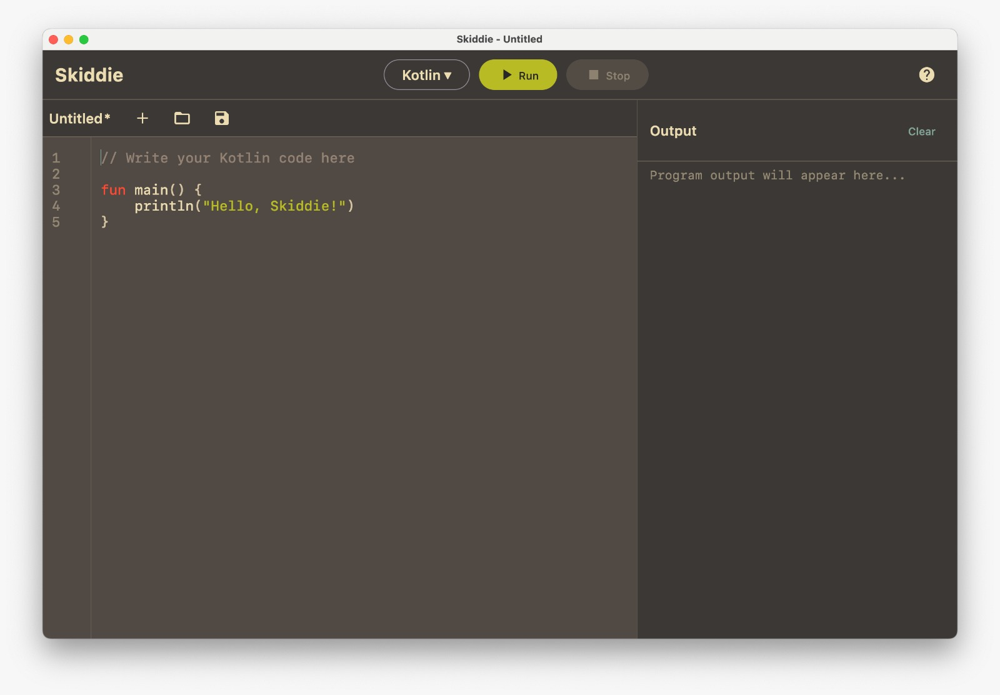
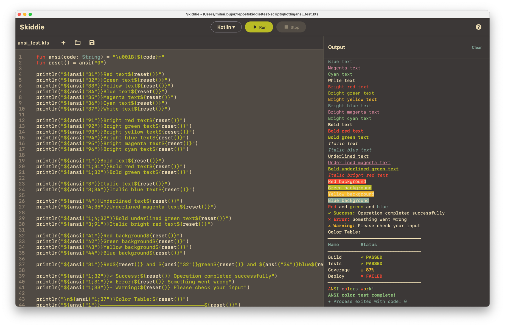
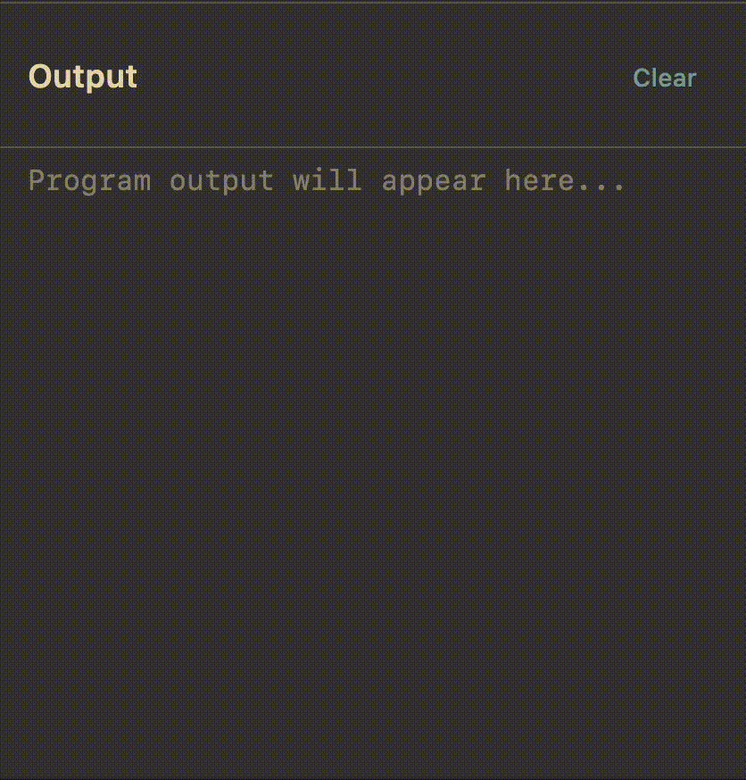

# Skiddie

A lightweight, cross-platform script editor built with Compose Desktop.

## Prerequisites

- **JDK 21** - Required to build and run
- **Kotlin Compiler** - For running Kotlin scripts (`kotlinc`)
- **Swift** - For running Swift scripts (macOS/Linux)

## Demo

### MacOS support


### Ansi color support


### User input support


## Features

- **Syntax Highlighting** - Tree-sitter powered highlighting for Kotlin and Swift
- **Interactive Terminal** - Run scripts and see output in real-time with stdin support
- **File Management** - New, open, save with keyboard shortcuts
- **Keyboard Shortcuts** - Fast workflow with shortcuts for all operations
- **Cross-platform** - Runs on macOS, Linux, and Windows

## Build & Run

### Development

```bash
./gradlew run
```

### Build Standalone Application

```bash
./gradlew package

# Or
./gradlew packageDistributionForCurrentOS

# Or build specific formats:
./gradlew packageDmg    # macOS .dmg installer
./gradlew packageDeb    # Linux .deb package
./gradlew packageMsi    # Windows .msi installer
```

## Keyboard Shortcuts

- `Cmd/Ctrl + Enter` - Run/Stop script
- `Cmd/Ctrl + N` - New file
- `Cmd/Ctrl + O` - Open file
- `Cmd/Ctrl + S` - Save file
- `Cmd/Ctrl + L` - Clear terminal
- `Cmd/Ctrl + ←/→` - Focus editor/terminal
- `?` button - Show all shortcuts
